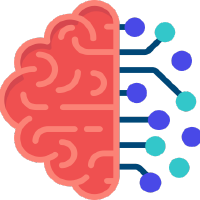

### Welcome!

  
  &emsp;
  
  &emsp;
  
  &emsp;
  
  &emsp;
  
  &emsp;
  

I'm [Michael Hopwood](https://hopml.readthedocs.io/en/latest/), PhD student in data science at the **University of Central Florida**. My work experience spans both applied and theoretical data science. In particular, I'm interested in graph neural networks and probabilistic machine learning especially in their applications to physics, but I usually find most things interesting.

News & Updates: (Click to expand)

<ul id="news">
<li>August 2022. Began internship on Amazon's risk analysis team. </li>
<li>May 2022. Began internship on Microsoft's bing search optimization team. </li>
<li>January 2022. Began internship on Tesla's charging data modeling team. </li>
<li>January 2022. Passed master's comprehensive exam in Data Science! </li>
<li>October 2021. <a href="https://www.abstractsonline.com/pp8/#!/10390/presentation/6852" target="_blank"> Oral presentation </a> at INFORMS Annual Meeting 2021 regarding a failure detection technique using gaussian-emission hidden markov models </li>
<li>September 2021. ICUFN 2021 <a href="https://ieeexplore.ieee.org/document/9528662" target="_blank"> proceedings </a> published</li>
<li>August 2021. Invited to speak at network science conference, <a href="http://icufn.org/" target="_blank"> ICUFN 2021 </a> about work which validated active learning practices with simulations (an extension from the previous journal paper).</li>
<li>May 2021. Released <a href="https://github.com/sandialabs/pvOps" target="_blank"> open-source python package </a> tackling machine learning & simulation applications in photovoltaic systems.
<li>April 2021. Journal <a href="https://www.mdpi.com/2078-2489/12/4/170" target="_blank"> paper </a> published which explores a phenomenon that ties network topology to active learning in graph neural networks</li>
<li>April 2021. Participated in <a href="https://stanford-open-datathon.devpost.com/" target="_blank"> stanford datathon</a> and submitted report about applications of generalized low rank models to <a href="https://github.com/MichaelHopwood/UCFParkingAI" target="_blank"> garage parking capacity</a></li>
<li>March 2021. Won 2nd place in 2021 OUC Data Science Competition focused on <a href="https://hopml.readthedocs.io/en/latest/projects.html#electric-vehicle-detection" target="_blank"> Electric Vehicle Detection</a></li>
<li>December 2020. <a href="https://ui.adsabs.harvard.edu/abs/2020AGUFMIN0140003H/abstract" target="_blank"> Presented at AGU</a> a methodology using data fusion techniques (both NLP and timeseries) to study the effect of extreme weather events on photovoltaic systems </li>
<li>September 2020. Journal <a href="https://ieeexplore.ieee.org/iel7/6287639/8948470/09186596.pdf" target="_blank">paper</a> published studying the use of neural networks on failure classification in PV systems</li>
<li>August 2020. Began company which designed, built, and deployed a Bayesian ML-informed algotrading agent, using the funds of an angel investor, along with two other software developers.</li>
<li>August 2020. Started my PhD at UCF!</li>
<li>June 2020. Presented at IEEE PVSC 47 (and <a href="https://www.linkedin.com/posts/michael-hopwood-43ba97123_pvsc-activity-6682102621374877696-ZgIG" target="_blank">won best student paper</a> )about the use of principal component analysis and random forest (RF) on current-voltage curves in a failure classification task; released in a <a href="https://ieeexplore.ieee.org/abstract/document/9300601/" target="_blank">paper</a></li>
<li>May 2020. Began R&D internship at Sandia National Labs!</li>
<li>August 2019. Release first <a href="https://github.com/MichaelHopwood/PVPolyfit/" target="_blank">open-source machine learning package</a> using physics-informed kernels and unsupervised learning focused on energy modeling in photovoltaics systems which has, to date, over 6k downloads.</li>
<li>June 2019. <a href="https://ieeexplore.ieee.org/abstract/document/8980896/" target="_blank">Project</a> accepted to IEEE PVSC 46 delineating methods of physically simulating failures in PV systems</li>
</ul>

  
  
For more updates, please visit my [personal page](https://hopml.readthedocs.io/en/latest/).
